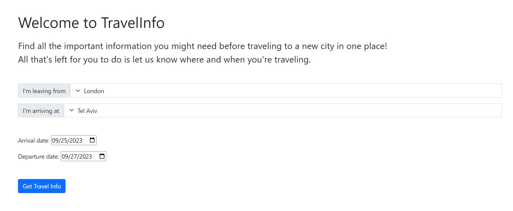
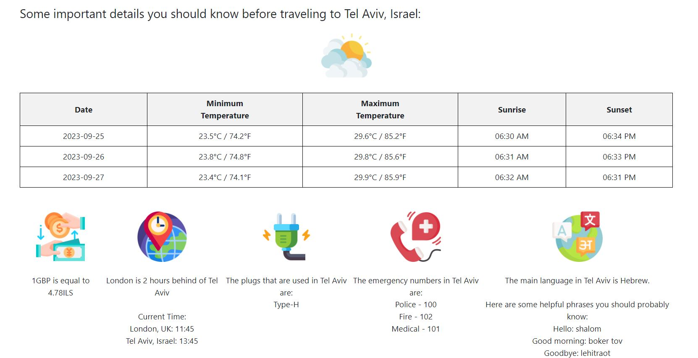

# TravelInfo
TravelInfo is a web application designed to assist individuals traveling overseas.
Users can input their starting city and destination, along with travel dates, to receive essential information.
This includes an approximate weather forecast, currency exchange rate, time differences, the plug type used in the destination country, emergency numbers and a few helpful phrases in the local language.

The project was developed in Python and HTML using API requests, JSON and Flask framework.

The project's UI:
 
Screen 1:

Screen 2:

